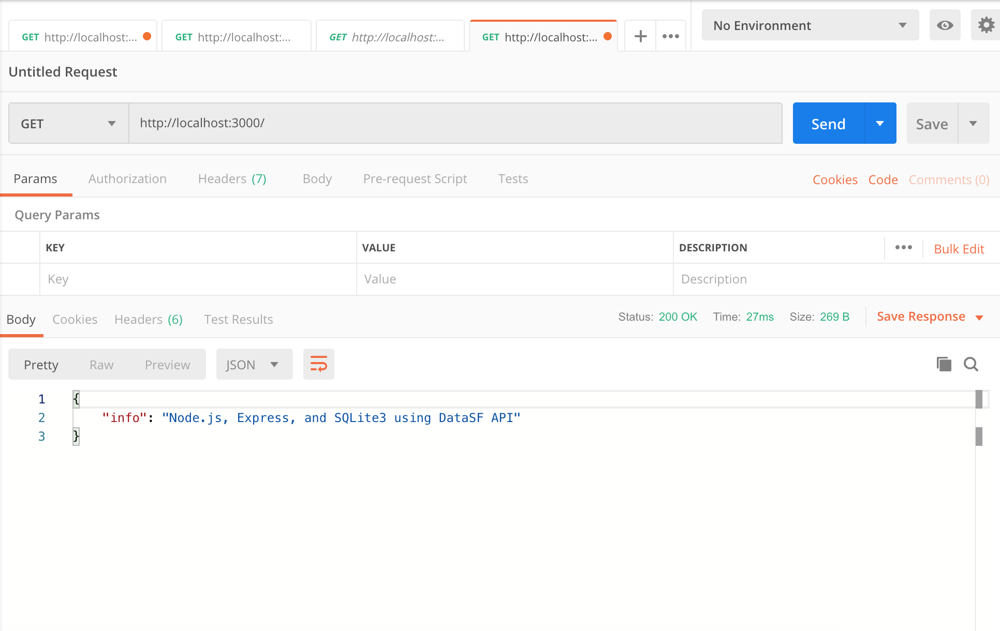
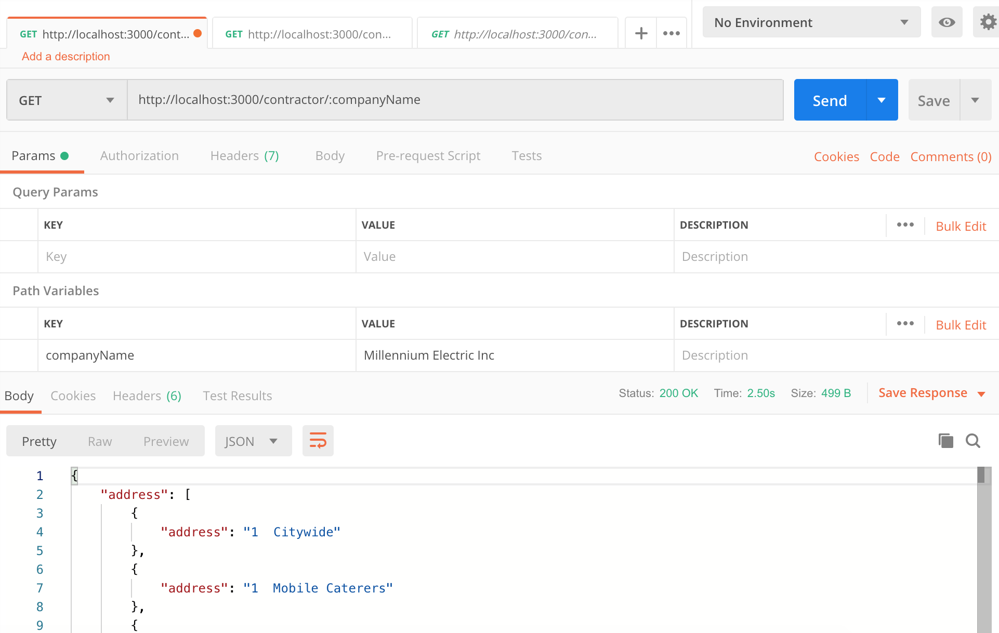
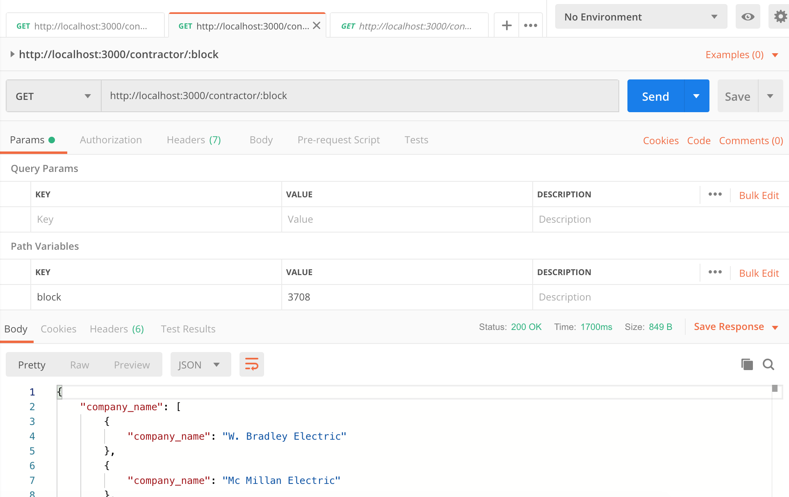

# Backend take home exercise

API using 
- Node.js
- Express
- SQLite

Run server: node index.js

## Endpoints: 

http://localhost:3000/

### Contractor's report

http://localhost:3000/contractor/:companyName

### City report

http://localhost:3000/contractor/:block

