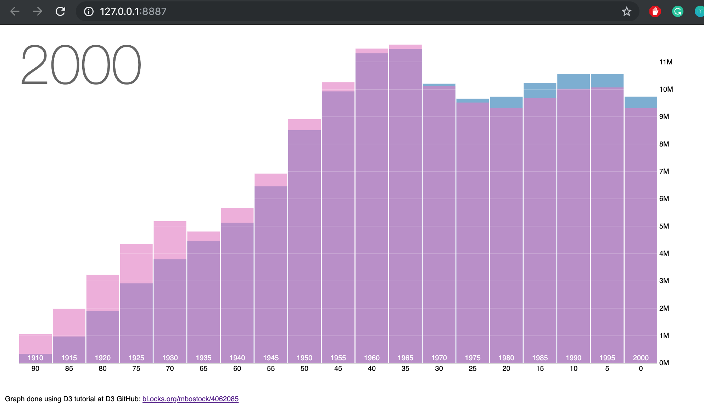
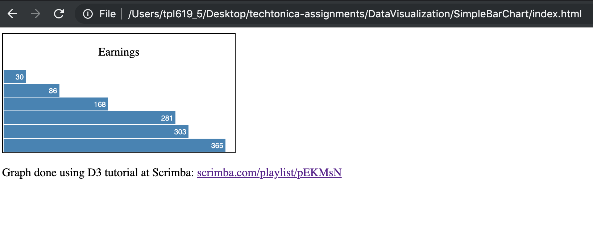

# Data Visualization

Graphs done using D3

Run Web Server for Chrome Extension to see graphs 
https://chrome.google.com/webstore/detail/web-server-for-chrome/ofhbbkphhbklhfoeikjpcbhemlocgigb?hl=en

## Population Pyramid

Tutorial: https://bl.ocks.org/mbostock/4062085

## Simple bar chart

Tutorial: https://scrimba.com/playlist/pEKMsN

