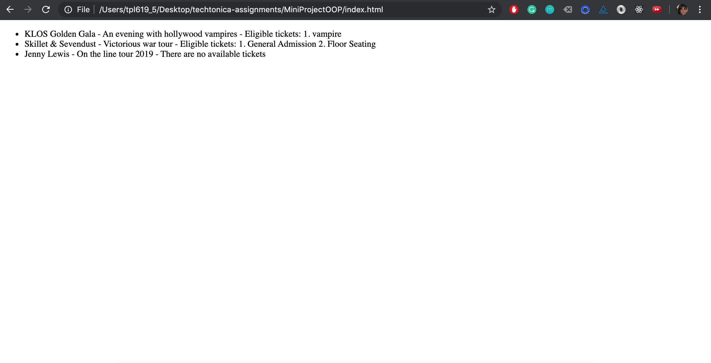

## Mini Project Object-Oriented Programming

- class `Ticket` creates a ticket with its type and price
- class `Events` creates an event with name, description and available tickets
- function `addAvailableTickets` create tickets using class `Ticket` and adding to `Events` class
- function `searchTickets` search for min and max price according to parameters given and return eligible tickets 

Tutorial: https://github.com/Techtonica/curriculum/blob/master/javascript/first-js-oop-project.md

