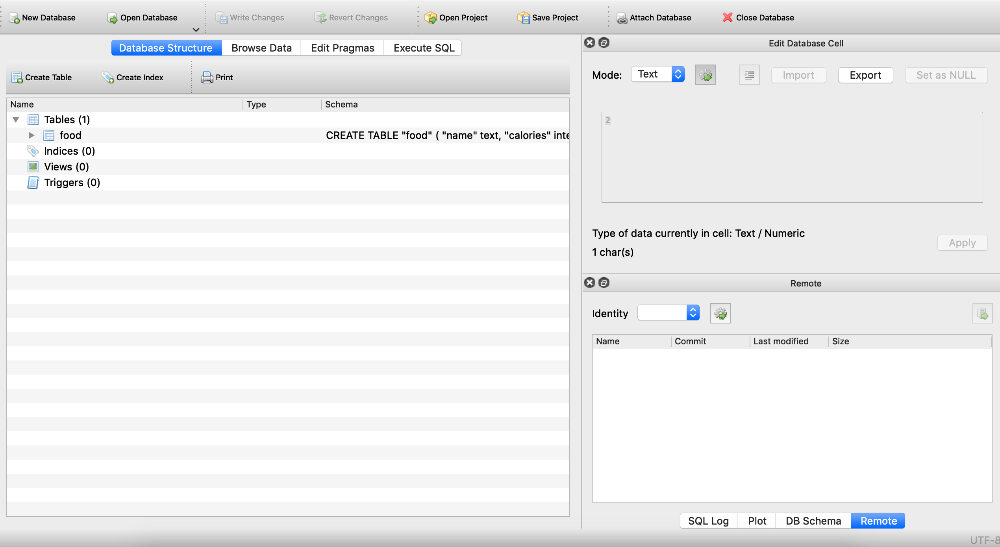
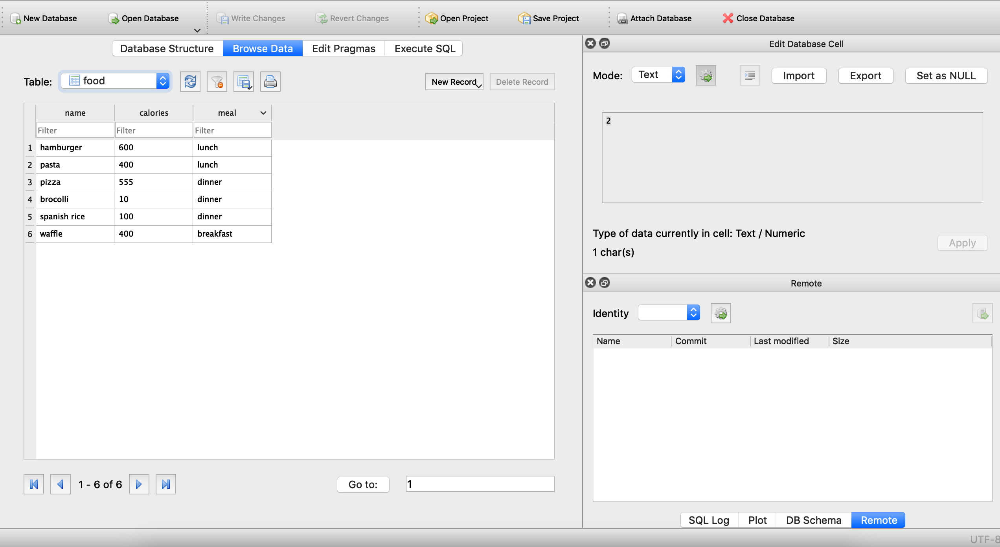
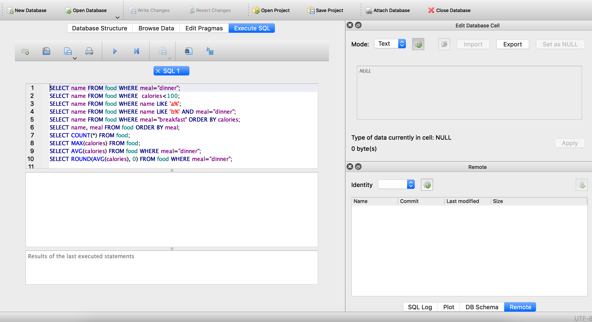

### SQL part 1

- Make a data model for this app, and answer the following questions:

https://docs.google.com/spreadsheets/d/1Hswej6-xidH6pYOFQ1oScJ770OmauU95SiJODec-gb8/edit?usp=sharing

What is the entity?
In this case there are only one entity (one table)

What are the attributes of the entity?
index	
recipe_name	
recipe_description	
vegetarian	
added_on	
which_meal	
times_done	
recipe_by																			

What is the primary key of the entity?
index

What are the data types of the attributes?
index => int
recipe_name	=> string
recipe_description => string	
vegetarian => boolean
added_on => date
which_meal => string
times_done => int
recipe_by => string

- Codecademy SQL

