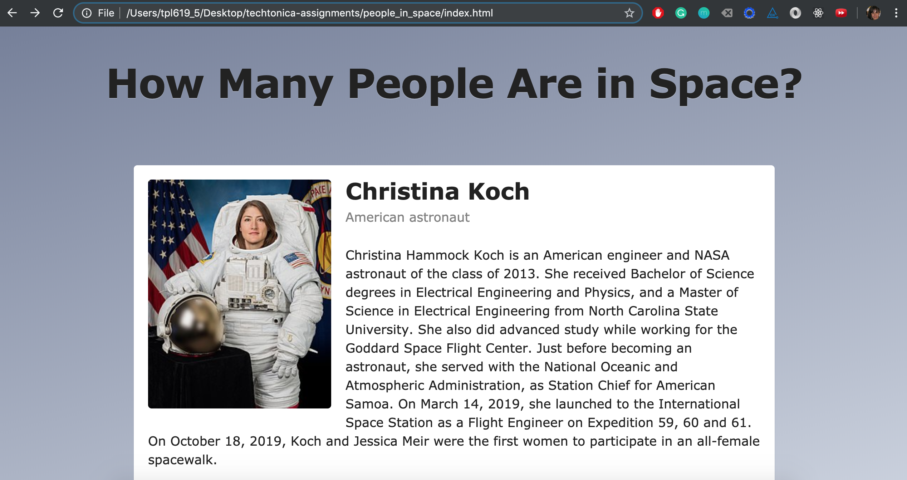

## How many people are in space?

Project created using Open Notify API and Wikipedia API

API calls can be made using:
- Callback
- Promise
- Fetch
- Async-Await

(Just comment/uncomment desired method in `index.html` file)

Tutorial: https://teamtreehouse.com/library/asynchronous-programming-with-javascript
